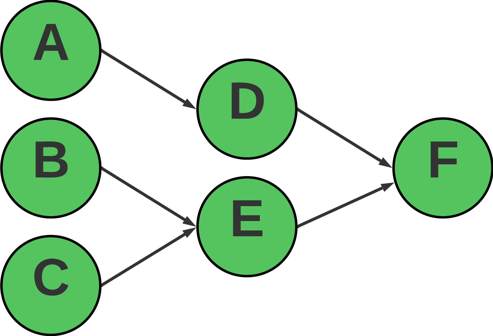
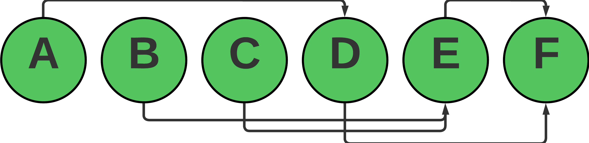

# Minimum Completion Time Task Scheduler

This project demonstrates a solution to calculate the minimum completion time for a set of tasks with dependencies. The goal is to find the order in which tasks should be executed to complete the job as quickly as possible, considering the task durations and their dependencies.

## Problem Statement

Given a set of tasks, each with a specific duration and a set of dependencies, the objective is to:
1. Calculate the minimum time required to complete all the tasks.
2. Determine the order of execution of the tasks to achieve the minimum completion time.

### Example

Consider the following tasks and dependencies:

- **Tasks and Durations:**
  - A: 3 units
  - B: 2 units
  - C: 4 units
  - D: 5 units (depends on A)
  - E: 2 units (depends on B, C)
  - F: 3 units (depends on D, E)

### Output

For the above configuration:
- **Minimum Completion Time:** 14 units
- **Order of Tasks:** A → B → C → D → E → F

## Implementation

The solution uses a topological sorting approach with dynamic programming to calculate the minimum completion time for the tasks. The steps are as follows:

1. **Initialize Task Data:** Create a map to store task information, in-degrees, and dependencies.
2. **Graph Construction:** Build the graph and count the in-degrees of each task.
3. **Topological Sorting:** Process tasks with no dependencies (in-degree = 0) and update their dependent tasks' earliest completion times.
4. **Detect Cycles:** Check if all tasks are processed. If not, a circular dependency is detected.
5. **Calculate Completion Time:** Find the maximum time in the earliest completion times map to get the minimum time required to complete all tasks.

### Prerequisites

- Go (Golang) installed on your system

## Implementation

The solution uses a topological sorting approach with dynamic programming to calculate the minimum completion time for the tasks. The steps are as follows:

1. **Initialize Task Data:** Create a map to store task information, in-degrees, and dependencies.
2. **Graph Construction:** Build the graph and count the in-degrees of each task.
3. **Topological Sorting:** Process tasks with no dependencies (in-degree = 0) and update their dependent tasks' earliest completion times.
4. **Detect Cycles:** Check if all tasks are processed. If not, a circular dependency is detected.
5. **Calculate Completion Time:** Find the maximum time in the earliest completion times map to get the minimum time required to complete all tasks.

## Error Handling

- If a task dependency does not exist in the task list, the program will return an error.
- If there is a circular dependency, the program will detect it and return an error message.  
